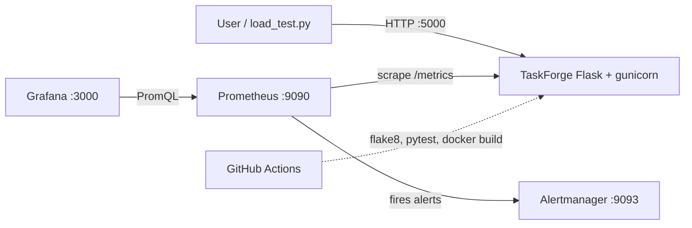

# TaskForge

A small DevOps demo: a Flask to-do app wrapped in Docker, monitored with Prometheus,
Grafana and Alertmanager, and checked by GitHub Actions CI.

## Prerequisites

Docker (with the Compose plugin). Nothing else.

## Setup (one command)

```bash
./setup.sh          # Linux / macOS
.\setup.ps1         # Windows PowerShell
```

It checks Docker, runs `docker compose up -d --build`, waits for `/health`, and prints the URLs.
Stop everything with `docker compose down`.

## URLs

| Service | URL | Notes |
|---|---|---|
| App | http://localhost:5000 | UI; API at `/api/tasks` |
| Metrics | http://localhost:5000/metrics | Prometheus format |
| Prometheus | http://localhost:9090 | Targets, alerts |
| Grafana | http://localhost:3000 | Anonymous viewer, or `admin` / `admin` |
| Alertmanager | http://localhost:9093 | Fired alerts |

## Demo steps

1. Open the app, add, complete and delete a few tasks.
2. Open Grafana → *TaskForge* dashboard (request rate, p95 latency, error rate, total requests).
3. Generate mixed traffic (including `/error`) for two minutes:
   `python3 scripts/load_test.py --duration 120`
4. Watch the error-rate panel rise; after about a minute the **HighErrorRate** alert turns
   *firing* in Prometheus (`/alerts`) and appears in Alertmanager.
5. Run `docker compose stop app` → **AppDown** fires. Restore with `docker compose start app`.

Run the tests locally: `pip install -r requirements-dev.txt && flake8 . && pytest`.

## Architecture



## Metrics

`app_http_requests_total{method,endpoint,status}`,
`app_http_request_duration_seconds{endpoint}` (histogram),
`app_http_errors_total{endpoint}`.

## Course topics

| Component | Course topic |
|---|---|
| `Dockerfile`, `docker-compose.yml` | Docker (multi-stage build, non-root, healthcheck, Compose) |
| `prometheus/`, `grafana/`, `alertmanager/` | Prometheus / Grafana / Alertmanager |
| `.github/workflows/ci.yml` | GitHub Actions CI |
| YAML configs, `setup.sh` | YAML / Bash |
| `setup.ps1`, `scripts/load_test.py`, `tests/` | Python automation (and PowerShell) |
